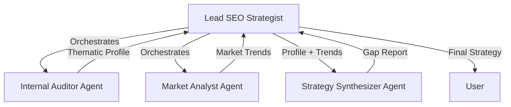
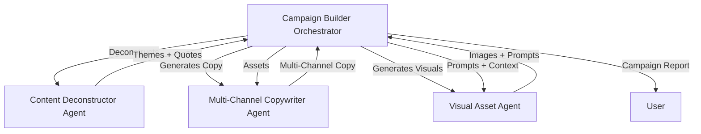

# End-to-End Content Engine Walkthrough

This document covers the implementation and verification of the two core phases of the Content Engine.

---

## Phase 1: Opportunity Discovery (The SEO Strategist)

The "SEO Strategist" identifies high-value content opportunities by auditing internal authority and analyzing market trends.

### Architecture

### Key Features
- **Scale-Aware Auditing**: Uses sitemap sampling to handle large sites like Patagonia.
- **Market Insight**: Identifies competitor gaps and trending keywords.
- **AgentTool Orchestration**: Centralized control via the root agent for reliable sequential workflows.

---

## Phase 2: Campaign Generation (The Campaign Builder)

The "Campaign Builder" transforms a drafted blog post into a full "Campaign-in-a-Box" across multiple channels.

### Architecture

### Key Features
- **Content Deconstruction**: Extracts core arguments and high-impact pull-quotes.
- **Multi-Channel Copy**: Tailors assets for Twitter, LinkedIn, Email, and Ads.
- **Real Image Generation**: Integrates **Gemini 3.1 Flash Image** for premium, brand-aligned visuals saved as artifacts.
- **Temporal Awareness**: All agents are locked to the **2026** current year context via the [GlobalInstructionPlugin](file:///usr/local/google/home/marcusmotill/Documents/code/aisummit-hackathon/backend/strategy/.venv/lib/python3.13/site-packages/google/adk/plugins/global_instruction_plugin.py#34-131).

---

## Verification Results

### Backend Initialization
Both backends have been verified to initialize correctly with their respective multi-agent configurations:
- **Strategy Backend**: `uv run python -c "from app.agent import app; print('SEO App initialized successfully')"`
- **Content Backend**: `uv run python -c "from app.agent import app; print('Content App initialized successfully')"`

### Testing in Playgrounds
1. **SEO Strategy**: `cd backend/strategy && make playground`
2. **Campaign Generation**: `cd backend/content && make playground`
